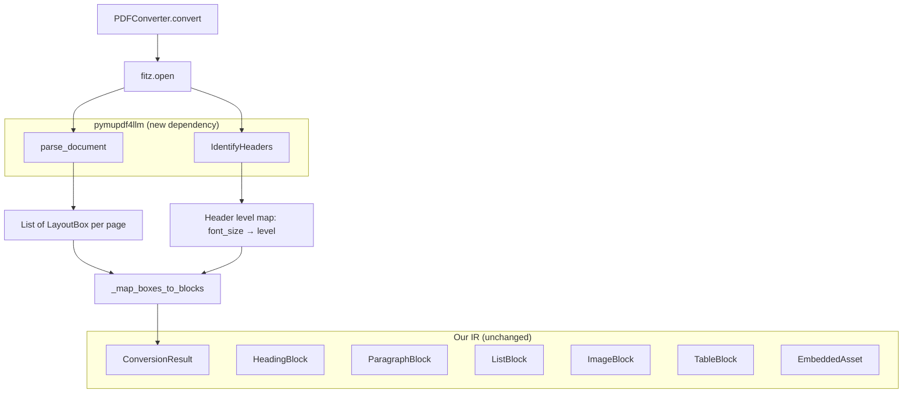
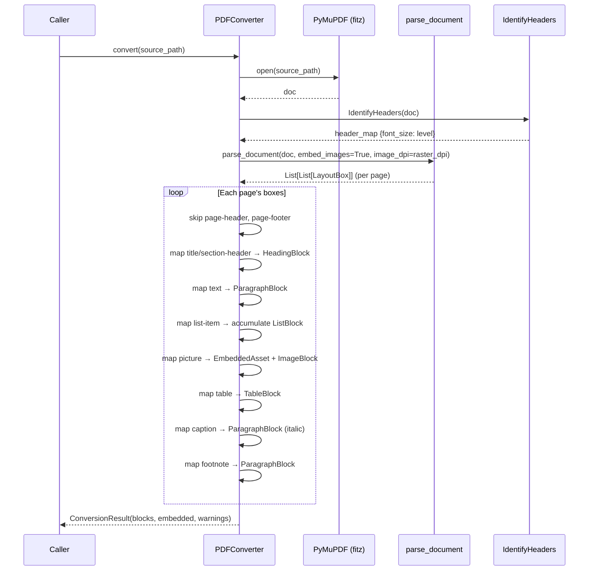

# Design Document: PDF Converter Refactor — pymupdf4llm

## Overview

This refactor replaces the ~750 lines of custom PDF extraction heuristics in `converter_pdf.py` with `pymupdf4llm`'s neural-network-based document layout analysis. The current implementation manually handles multi-column linearization, vector cluster detection, header/footer filtering, heading detection via font-size ratios, broken table extraction, bullet/list detection, and image extraction with size filtering. All of these are replaced by two calls:

1. `pymupdf4llm.helpers.document_layout.parse_document()` — classifies page content into typed LayoutBoxes (title, section-header, text, list-item, picture, table, caption, page-header, page-footer, footnote)
2. `pymupdf4llm.helpers.pymupdf_rag.IdentifyHeaders` — assigns fine-grained heading levels based on font-size analysis across the document

The public API (`BaseConverter.convert()`, `ConversionResult`, all Block types) remains unchanged. Only the internal extraction logic changes. The renderer, writer, and all non-PDF converters are unaffected.

## Architecture



## Sequence Diagram: PDF Conversion Flow



## Components and Interfaces

### Component 1: PDFConverter (refactored)

**Purpose**: Convert a PDF file to a `ConversionResult` using pymupdf4llm's layout analysis.

**Interface** (unchanged from current):
```python
class PDFConverter(BaseConverter):
    def __init__(self, raster_dpi: int = RASTER_DPI) -> None: ...
    def convert(self, source_path: Path) -> ConversionResult: ...
```

**Internal methods (new)**:
```python
class PDFConverter(BaseConverter):
    def _build_header_map(self, doc: fitz.Document) -> dict[float, int]:
        """Use IdentifyHeaders to get font_size → heading_level mapping."""
        ...

    def _map_boxes_to_blocks(
        self,
        pages_boxes: list[list[LayoutBox]],
        header_map: dict[float, int],
        blocks: list[Block],
        embedded: list[EmbeddedAsset],
        warnings: list[str],
    ) -> None:
        """Convert LayoutBoxes to IR blocks."""
        ...

    def _map_single_box(
        self,
        box: LayoutBox,
        header_map: dict[float, int],
        blocks: list[Block],
        embedded: list[EmbeddedAsset],
        list_accumulator: list[str],
        warnings: list[str],
    ) -> None:
        """Map one LayoutBox to the appropriate IR block type."""
        ...

    def _heading_level_from_box(
        self,
        box: LayoutBox,
        header_map: dict[float, int],
    ) -> int:
        """Determine heading level: use header_map for fine granularity."""
        ...

    def _extract_text_from_box(self, box: LayoutBox) -> str:
        """Join textlines spans into a single string."""
        ...

    def _extract_image_from_box(
        self,
        box: LayoutBox,
        embedded: list[EmbeddedAsset],
        warnings: list[str],
    ) -> ImageBlock | None:
        """Store box.image bytes as EmbeddedAsset, return ImageBlock."""
        ...

    def _extract_table_from_box(
        self,
        box: LayoutBox,
        warnings: list[str],
    ) -> TableBlock | None:
        """Convert box.table dict to TableBlock."""
        ...
```

**Responsibilities**:
- Open PDF via PyMuPDF
- Call `parse_document()` for layout classification
- Call `IdentifyHeaders()` for heading level assignment
- Map each LayoutBox to the corresponding IR block
- Accumulate consecutive list-items into a single ListBlock
- Store image bytes as EmbeddedAsset
- Skip page-header and page-footer boxes
- Report warnings for any extraction failures

### Component 2: LayoutBox (external, from pymupdf4llm)

**Purpose**: Represents a classified region of a PDF page.

**Interface** (read-only, from pymupdf4llm):
```python
class LayoutBox:
    boxclass: str       # 'title', 'section-header', 'text', 'list-item',
                        # 'picture', 'table', 'caption', 'page-header',
                        # 'page-footer', 'footnote'
    textlines: list[dict]  # list of dicts with 'spans' key (PyMuPDF text dict format)
    image: bytes | None    # PNG bytes when embed_images=True
    table: dict | None     # {'bbox', 'row_count', 'col_count', 'cells', 'extract', 'markdown'}
    x0: float
    y0: float
    x1: float
    y1: float
```

### Component 3: IdentifyHeaders (external, from pymupdf4llm)

**Purpose**: Analyze font sizes across the document to assign heading levels.

**Interface** (from pymupdf4llm):
```python
class IdentifyHeaders:
    def __init__(self, doc: fitz.Document, **kwargs) -> None: ...
    # Produces a mapping of font sizes to heading levels
    # Access pattern: header_id[font_size_int] → "# " | "## " | "### " | ... | ""
```

## Data Models

### LayoutBox → IR Block Mapping

| `box.boxclass`   | IR Block Type    | Notes                                           |
|------------------|------------------|-------------------------------------------------|
| `title`          | `HeadingBlock`   | Level from IdentifyHeaders (default: 1)         |
| `section-header` | `HeadingBlock`   | Level from IdentifyHeaders (default: 2)         |
| `text`           | `ParagraphBlock` | Join spans into text                            |
| `list-item`      | `ListBlock`      | Accumulate consecutive items                    |
| `picture`        | `ImageBlock`     | Store `box.image` as EmbeddedAsset              |
| `table`          | `TableBlock`     | Use `box.table['extract']` for cell data        |
| `caption`        | `ParagraphBlock` | Treat as italic paragraph                       |
| `page-header`    | *(skipped)*      | Filtered out                                    |
| `page-footer`    | *(skipped)*      | Filtered out                                    |
| `footnote`       | `ParagraphBlock` | Treat as regular paragraph                      |

### List Item Accumulation

Consecutive `list-item` boxes are accumulated into a single `ListBlock`. When a non-list-item box is encountered, the accumulator flushes:

```python
# Accumulation logic
list_accumulator: list[str] = []

for box in page_boxes:
    if box.boxclass == "list-item":
        list_accumulator.append(_extract_text_from_box(box))
    else:
        if list_accumulator:
            blocks.append(ListBlock(ordered=_detect_ordered(list_accumulator), items=list_accumulator))
            list_accumulator = []
        # process non-list box...
```

### Table Extraction from LayoutBox

```python
# box.table structure:
{
    "bbox": (x0, y0, x1, y1),
    "row_count": int,
    "col_count": int,
    "cells": list,           # cell boundary info
    "extract": list[list],   # 2D array of cell text (rows × cols)
    "markdown": str,         # pre-rendered markdown table
}

# Mapping to TableBlock:
extract = box.table["extract"]  # list[list[str | None]]
headers = [str(cell or "") for cell in extract[0]]
rows = [[str(cell or "") for cell in row] for row in extract[1:]]
```

### Heading Level Resolution

```python
def _heading_level_from_box(self, box: LayoutBox, header_map: dict[float, int]) -> int:
    """Determine heading level using IdentifyHeaders font-size map.
    
    Priority:
    1. If box has textlines with a font size in header_map → use that level
    2. If box.boxclass == 'title' → default level 1
    3. If box.boxclass == 'section-header' → default level 2
    """
    # Get dominant font size from box's textlines
    max_size = 0.0
    for tl in box.textlines:
        for span in tl.get("spans", []):
            size = span.get("size", 0.0)
            if size > max_size:
                max_size = size
    
    if max_size > 0 and max_size in header_map:
        return header_map[max_size]
    
    # Fallback based on boxclass
    if box.boxclass == "title":
        return 1
    return 2  # section-header default
```

## Key Functions with Formal Specifications

### Function 1: convert()

```python
def convert(self, source_path: Path) -> ConversionResult:
    """Convert a PDF file to ConversionResult using pymupdf4llm layout analysis."""
```

**Preconditions:**
- `source_path` is a valid Path object
- File at `source_path` exists (may or may not be a valid PDF)

**Postconditions:**
- Returns a valid `ConversionResult` (never raises for invalid PDFs)
- If PDF cannot be opened: `result.blocks == []` and `result.warnings` is non-empty
- If PDF is valid: `result.blocks` contains the document content as IR blocks
- All images stored in `result.embedded` with valid PNG bytes
- `result.embedded[i]` is referenced by exactly one `ImageBlock` with `asset_index == i`

**Loop Invariants:** N/A

### Function 2: _map_boxes_to_blocks()

```python
def _map_boxes_to_blocks(
    self,
    pages_boxes: list[list[LayoutBox]],
    header_map: dict[float, int],
    blocks: list[Block],
    embedded: list[EmbeddedAsset],
    warnings: list[str],
) -> None:
```

**Preconditions:**
- `pages_boxes` is a list of per-page LayoutBox lists (may be empty)
- `header_map` maps font sizes to heading levels (1–6)
- `blocks`, `embedded`, `warnings` are initialized (possibly empty) lists

**Postconditions:**
- All non-header/footer LayoutBoxes are mapped to corresponding IR blocks
- Consecutive list-items are merged into single ListBlock instances
- No page-header or page-footer boxes produce output blocks
- `len(embedded)` increases by the number of picture boxes with non-None image data
- Order of blocks matches reading order from parse_document

**Loop Invariants:**
- After processing box `i`: all boxes `0..i-1` have been mapped or skipped
- `list_accumulator` contains only consecutive unflushed list-item texts

### Function 3: _extract_text_from_box()

```python
def _extract_text_from_box(self, box: LayoutBox) -> str:
```

**Preconditions:**
- `box.textlines` is a list of dicts (may be empty)
- Each dict may have a `"spans"` key containing span dicts with `"text"` keys

**Postconditions:**
- Returns a string with all span text joined, lines separated by spaces
- Returns empty string if no text content found
- No leading/trailing whitespace in result

**Loop Invariants:** N/A

### Function 4: _extract_table_from_box()

```python
def _extract_table_from_box(self, box: LayoutBox, warnings: list[str]) -> TableBlock | None:
```

**Preconditions:**
- `box.table` is a dict with at least an `"extract"` key, or None
- `box.table["extract"]` is a 2D list (rows × cols) of str | None values

**Postconditions:**
- If `box.table` is None or `extract` is empty: returns None
- If `extract` has at least one row: returns `TableBlock` with first row as headers
- All None cells are converted to empty strings
- Returns None and appends to warnings if extraction fails

**Loop Invariants:** N/A

## Example Usage

```python
from pathlib import Path
from document2markdown.converter_pdf import PDFConverter

converter = PDFConverter(raster_dpi=150)
result = converter.convert(Path("research_paper.pdf"))

# Result is identical in structure to before the refactor
for block in result.blocks:
    match block:
        case HeadingBlock(level=lvl, text=txt):
            print(f"{'#' * lvl} {txt}")
        case ParagraphBlock(text=txt):
            print(txt)
        case ListBlock(ordered=ordered, items=items):
            for i, item in enumerate(items, 1):
                prefix = f"{i}." if ordered else "-"
                print(f"{prefix} {item}")
        case ImageBlock(asset_index=idx, alt=alt):
            asset = result.embedded[idx]
            print(f"")
        case TableBlock(headers=h, rows=r):
            print(f"Table: {len(h)} cols, {len(r)} rows")
```

## Error Handling

### Error Scenario 1: PDF cannot be opened

**Condition**: `fitz.open()` raises an exception (corrupt file, wrong format)
**Response**: Return `ConversionResult(blocks=[], embedded=[], warnings=[error_message])`
**Recovery**: Caller receives empty result with diagnostic warning

### Error Scenario 2: parse_document() fails

**Condition**: `parse_document()` raises an exception (internal pymupdf4llm error)
**Response**: Log error, return `ConversionResult(blocks=[], embedded=[], warnings=[error_message])`
**Recovery**: Caller receives empty result with diagnostic warning

### Error Scenario 3: IdentifyHeaders() fails

**Condition**: `IdentifyHeaders()` raises an exception
**Response**: Fall back to default heading levels (title=1, section-header=2)
**Recovery**: Conversion continues with less granular heading levels; warning appended

### Error Scenario 4: Individual box mapping fails

**Condition**: Exception during single box processing (e.g., corrupt image data)
**Response**: Skip the box, append warning, continue processing remaining boxes
**Recovery**: Partial result with warning about skipped content

### Error Scenario 5: Table extraction fails

**Condition**: `box.table["extract"]` is malformed or missing
**Response**: Skip the table, append warning
**Recovery**: Table content lost but document conversion continues

## Testing Strategy

### Unit Testing Approach

- Mock `parse_document()` and `IdentifyHeaders()` to return controlled LayoutBox lists
- Test each boxclass → IR block mapping independently
- Test list-item accumulation with various sequences
- Test heading level resolution with different header_map configurations
- Test error paths (None image, empty textlines, malformed table)
- Test that page-header/page-footer boxes are skipped

### Property-Based Testing Approach

**Property Test Library**: hypothesis

- Generate random sequences of LayoutBoxes and verify structural invariants
- Generate random table extracts and verify round-trip to TableBlock
- Generate random text spans and verify text extraction consistency

### Integration Testing Approach

- Existing property tests (`test_property_formats.py`) test the full pipeline and should pass unchanged
- Real PDF files tested manually to verify output quality improvement

## Performance Considerations

- `parse_document()` uses a neural network model — first call may be slower than raw heuristics
- Subsequent calls benefit from model caching within pymupdf4llm
- No per-page `get_text("dict")` calls needed — parse_document handles everything
- No separate `get_drawings()` / `get_pixmap()` calls — images come pre-extracted
- Overall: slightly slower per-page but more accurate; acceptable tradeoff for research documents

## Dependencies

- `pymupdf4llm` — replaces raw `PyMuPDF` as the primary PDF extraction dependency
  - Internally depends on `PyMuPDF` (so fitz is still available)
  - Provides `pymupdf4llm.helpers.document_layout.parse_document`
  - Provides `pymupdf4llm.helpers.pymupdf_rag.IdentifyHeaders`
- `PyMuPDF` — still used for `fitz.open()` (via pymupdf4llm's dependency)
- All other dependencies unchanged

## Correctness Properties

*A property is a characteristic or behavior that should hold true across all valid executions of a system — essentially, a formal statement about what the system should do. Properties serve as the bridge between human-readable specifications and machine-verifiable correctness guarantees.*

### Property 1: Box-to-block type mapping consistency

*For any* valid LayoutBox with a recognized boxclass, the resulting IR block type must match the defined mapping: title/section-header → HeadingBlock, text/caption/footnote → ParagraphBlock, list-item → ListBlock (after accumulation), picture → ImageBlock, table → TableBlock. No other block types are produced.

**Validates: Requirements 4.1, 4.2, 4.3, 4.4, 4.5, 4.6, 4.7, 4.8**

### Property 2: Header/footer exclusion

*For any* LayoutBox with boxclass "page-header" or "page-footer", no corresponding IR block is produced in the output.

**Validates: Requirements 8.1, 8.2**

### Property 3: List item accumulation preserves items

*For any* sequence of consecutive list-item LayoutBoxes, the resulting ListBlock contains exactly the same number of items as there were consecutive list-item boxes, and each item's text matches the extracted text from the corresponding box.

**Validates: Requirements 5.1, 5.2, 5.3**

### Property 4: Image asset indexing integrity

*For any* picture LayoutBox with non-None image data, the resulting ImageBlock's `asset_index` correctly references the corresponding EmbeddedAsset in the embedded list, and `embedded[asset_index].data` equals the original `box.image` bytes.

**Validates: Requirements 6.1, 6.2**

### Property 5: Table extraction preserves dimensions

*For any* table LayoutBox with a valid `extract` field containing R rows and C columns, the resulting TableBlock has `len(headers) == C` and `len(rows) == R - 1` (first row becomes headers), and all None cells are converted to empty strings.

**Validates: Requirements 7.1, 7.2, 7.4**

### Property 6: Text extraction completeness

*For any* LayoutBox with non-empty textlines, `_extract_text_from_box()` returns a non-empty string containing all span text content from the box (no text is silently dropped), with no leading or trailing whitespace.

**Validates: Requirements 11.1, 11.2**

### Property 7: Conversion never raises

*For any* valid file path (including corrupt/non-PDF files), `convert()` returns a `ConversionResult` without raising an exception. Invalid inputs produce empty blocks with warnings.

**Validates: Requirements 9.1, 9.2, 9.4**
