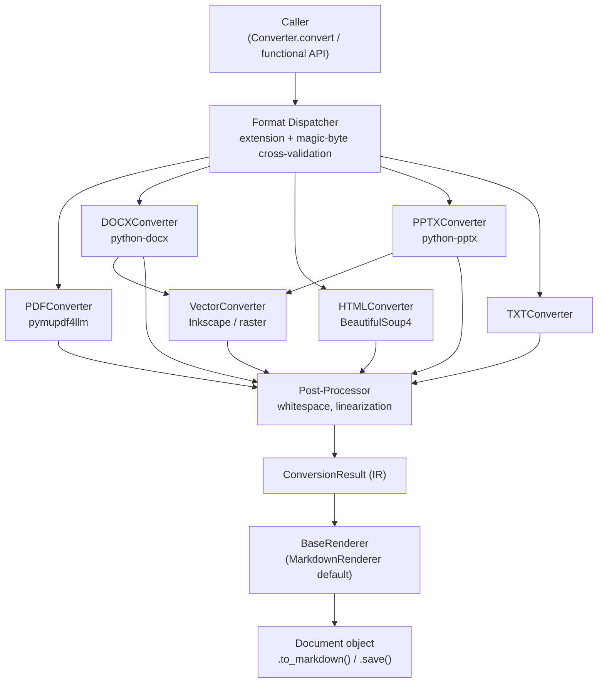
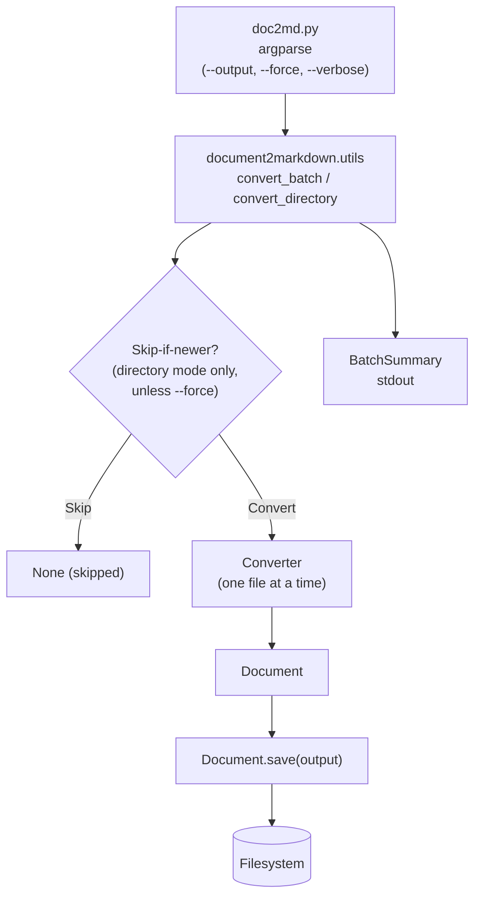

# Design Document: document-to-markdown

## Overview

A Python CLI script (`doc2md.py`) and importable library (`document2markdown`) that converts documents in PDF, DOCX, HTML, PPTX, and TXT formats into clean, well-formed Markdown files. The script is designed for developer workflows where diverse document types need to be fed into AI assistants like Kiro. It supports single-file and batch conversion, preserves document structure as faithfully as possible, and reports errors clearly.

Key design goals:
- Modular per-format converter architecture for easy extension
- Robust error handling that never silently drops content
- Clean, AI-readable Markdown output (UTF-8, no noise)
- Relative-path, URL-encoded links for embedded assets

---

## Architecture

The system has two distinct entry points that share the same core library.

### Core Library (`document2markdown` package)

The library pipeline handles one file at a time:



The caller receives a `Document` object. From there they can get the rendered string, the raw `ConversionResult`, or write to disk.

### CLI Script (`doc2md.py`)

The CLI is a thin layer over the library. It uses `document2markdown.utils` for multi-file support:



The CLI never touches the pipeline directly — it only orchestrates via the public API.
Skip-if-newer logic lives in `convert_directory` (checked before conversion).
File-list mode always converts and overwrites.

---

## Components and Interfaces

### CLI Layer (`doc2md.py`)

Parses arguments using `argparse`:

```
usage: doc2md.py [-h] [--output OUTPUT] [--force] [--verbose] file [file ...]
```

- `file` — one or more source document paths (positional, required)
- `--output` — target file path or directory
- `--force` — reconvert all files regardless of modification timestamps (overrides skip-if-newer logic)
- `--verbose` — print per-file progress to stdout

Drives the batch loop, collects success/failure counts, prints the final summary.

### Format Dispatcher (`document2markdown/dispatcher.py`)

Determines the file type using two independent methods and cross-validates them before routing to a converter:

1. **File extension** — maps the path suffix to a known format.
2. **Magic byte inspection** — calls `python-magic` (`libmagic`) to read the file's MIME type from its binary header.

Both methods must agree. If they disagree, the file is treated as unsupported and an error is logged to stderr identifying the file and both conflicting types. If neither method can identify the type, the unsupported-format error path (Requirement 1.6) is followed.

```python
EXTENSION_TO_MIME: dict[str, str] = {
    ".pdf":  "application/pdf",
    ".docx": "application/vnd.openxmlformats-officedocument.wordprocessingml.document",
    ".html": "text/html",
    ".htm":  "text/html",
    ".pptx": "application/vnd.openxmlformats-officedocument.presentationml.presentation",
    ".txt":  "text/plain",
}

CONVERTERS: dict[str, type[BaseConverter]] = {
    ".pdf":  PDFConverter,
    ".docx": DOCXConverter,
    ".html": HTMLConverter,
    ".htm":  HTMLConverter,
    ".pptx": PPTXConverter,
    ".txt":  TXTConverter,
}
```

Detection logic (pseudocode):

```python
def resolve_converter(path: Path) -> type[BaseConverter]:
    ext = path.suffix.lower()
    ext_mime = EXTENSION_TO_MIME.get(ext)          # None if unknown extension
    magic_mime = magic.from_file(str(path), mime=True)

    if ext_mime is None and magic_mime not in EXTENSION_TO_MIME.values():
        raise UnsupportedFormatError(path, ext_mime, magic_mime)

    if ext_mime is not None and not magic_mime.startswith(ext_mime.split(";")[0]):
        raise MimeExtensionMismatchError(path, ext_mime, magic_mime)

    return CONVERTERS[ext]
```

`MimeExtensionMismatchError` is a subclass of `UnsupportedFormatError` that carries both the extension-derived and magic-byte-derived type strings for inclusion in the stderr message.

### BaseConverter (`document2markdown/converter_base.py`)

Abstract base class all converters implement:

```python
class BaseConverter(ABC):
    @abstractmethod
    def convert(self, source_path: Path) -> ConversionResult:
        """Convert source document to intermediate representation."""
```

### Per-Format Converters

| Converter | Library | Notes |
|-----------|---------|-------|
| `PDFConverter` | `pymupdf4llm` + `PyMuPDF` | Neural-network layout analysis via `parse_document()`; heading levels via `IdentifyHeaders`. See `pdf-pymupdf4llm-refactor` spec for details. |
| `DOCXConverter` | `python-docx` + `Inkscape` | Walks document XML; maps styles to heading levels; converts embedded EMF/WMF drawing objects to SVG |
| `HTMLConverter` | `BeautifulSoup4` + `markdownify` | Parses DOM; maps tags to Markdown equivalents |
| `PPTXConverter` | `python-pptx` + `Inkscape` / `Pillow` | Iterates slides in order; title → H2, body → paragraphs; converts embedded EMF/WMF to SVG via Inkscape, EPS to PNG via Pillow+Ghostscript |
| `TXTConverter` | stdlib only | Wraps content in fenced code block or plain paragraphs |
| `XLSXConverter` | `openpyxl` | Produces markdown index with CSV-per-sheet as linked assets; extracts embedded images; notes non-exportable charts |

### VectorConverter (`document2markdown/converter_vector.py`)

Vector graphic conversion is handled by a shared `VectorConverter` utility (`document2markdown/converter_vector.py`) called by any converter that encounters an embedded vector object. It accepts raw bytes plus a source format hint (EMF, WMF, EPS) and attempts conversion using format-specific strategies:

**EMF / WMF:**
1. **Inkscape SVG** (`--export-type=svg`) — preferred; converts to SVG via shell call.
2. **Inkscape PNG raster** (`--export-type=png --export-dpi=<dpi>`) — fallback if SVG export fails.

**EPS:**
1. **Pillow + Ghostscript** → PNG — Inkscape 1.4+ on macOS cannot open EPS from the CLI, so EPS is rasterized to PNG via Pillow (which shells out to `gs`). Ghostscript must be installed.

DPI is configurable via `RASTER_DPI` in `config.py`, default 300. PNG assets are saved to `md_embedded/` like any other embedded asset.

If all methods fail for a given format, a warning is logged and an `UnsupportedBlock` note is inserted in the IR instead.

### Intermediate Representation (`document2markdown/document_model.py`)

A lightweight document model that decouples parsing from rendering:

```python
@dataclass
class ConversionResult:
    blocks: list[Block]          # ordered document blocks
    embedded: list[EmbeddedAsset]  # images / other extracted assets
    warnings: list[str]          # non-fatal issues encountered

@dataclass
class EmbeddedAsset:
    data: bytes
    extension: str               # e.g. ".png", ".svg"
    original_name: str | None    # original filename if available
    alt_text: str                # alt text for Markdown image tag
    source_vector_format: str | None  # "emf" | "wmf" | "eps" | None
    # When source_vector_format is set, data contains converted SVG bytes
    # and extension is always ".svg"
```

Block types (union / tagged):
- `HeadingBlock(level: int, text: str)`
- `ParagraphBlock(text: str)`
- `ListBlock(ordered: bool, items: list[str])`
- `TableBlock(headers: list[str], rows: list[list[str]])`
- `CodeBlock(language: str | None, text: str)`
- `ImageBlock(asset_index: int, alt: str)`
- `LinkBlock(text: str, url: str | None = None, asset_index: int | None = None)`
- `UnsupportedBlock(description: str)`

### Post-Processor (`document2markdown/postprocess.py`)

Operates on `ConversionResult`:
- Collapses runs of more than two consecutive blank lines
- Strips non-printable control characters (except `\n`, `\t`)
- Strips page numbers, headers, and footers (heuristic patterns)
- Normalizes heading levels (ensures H1 is not duplicated excessively)

### Output Renderer (`document2markdown/renderer_base.py`)

Rendering is abstracted behind a `BaseRenderer` interface, mirroring the `BaseConverter` pattern on the input side:

```python
class BaseRenderer(ABC):
    @abstractmethod
    def render(self, result: ConversionResult) -> str:
        """Serialize a ConversionResult to an output string."""

class MarkdownRenderer(BaseRenderer):
    """Default renderer — produces GitHub-Flavored Markdown."""
    def render(self, result: ConversionResult) -> str: ...
```

This allows alternative renderers (e.g. `ObsidianMarkdownRenderer`, `PlainTextRenderer`, `HTMLRenderer`) to be dropped in without touching the pipeline. Third-party code can subclass `BaseRenderer` and pass an instance to `Converter` or the functional API.

### Output Writer (`document2markdown/writer.py`)

Serializes a rendered string and embedded assets to disk. The writer's interface is intentionally minimal — it receives a **resolved `output_dir: Path`** from its caller and writes there. Path resolution logic (default directory names, mirroring) lives in the orchestration layer (`Document.save()`, `utils.convert_directory()`, CLI), not in the writer.

- Accepts a `BaseRenderer` instance; calls `renderer.render(result)` to produce the output string
- Writes output string to `{output_dir}/{base_name}.md`
- Writes embedded assets to `{output_dir}/{EMBEDDED_DIR}/{base_name}_{serial:04d}{ext}` — uses `EMBEDDED_DIR` constant from `config.py` directly (not passed as a parameter)
- Generates URL-encoded relative paths for all image/link references
- Creates output directories as needed (`mkdir(parents=True)`)
- If target `.md` already exists → overwrite with stderr warning

The writer is intentionally simple — it always writes when called. Skip-if-newer logic lives in the orchestration layer (`convert_directory` in `utils.py`), not in the writer.

#### Default Output Directory (resolved by `Document.save()`)

The writer does NOT compute the default output directory — it just receives `output_dir`. The default path logic lives in `Document.save()`:

When `Document.save(output=None)` is called and no explicit `output_dir` was set on the parent `Converter`:
- **Single-file conversion**: `output_dir = source_path.parent / OUTPUT_DIR_NAME`
- The output directory is **always relative to the source** — NEVER relative to CWD.

`OUTPUT_DIR_NAME` is a constant in `config.py` (default: `"Exports - Conversions"`), read by `Document.save()` the same way the writer reads `EMBEDDED_DIR`.

#### Directory Structure Mirroring (resolved by `convert_directory()`)

Mirroring logic lives in `utils.convert_directory()`, not in the writer. The utility computes a per-file `output_dir` and passes it to `Document.save(output=resolved_dir)`:

```python
relative = source_path.relative_to(traversed_root)
output_dir = traversed_root / OUTPUT_DIR_NAME / relative.parent
# Writer receives this resolved path — writes {output_dir}/{basename}.md
```

The writer's existing behavior (write `.md` + `EMBEDDED_DIR/` under the given `output_dir`) naturally produces the correct mirrored structure:
- Source files in subdirectories produce output in corresponding subdirectories.
- `EMBEDDED_DIR/` (default: `md_embedded/`) lives alongside each `.md` at its depth — NOT a single shared directory at the output root.

Example: converting `docs/` containing `docs/doc.doc`, `docs/pdf.pdf`, and `docs/deeper/pdftoo.pdf`:
```
docs/
  doc.doc
  pdf.pdf
  deeper/pdftoo.pdf
  Exports - Conversions/
    doc.md
    pdf.md
    md_embedded/
      pdf_0001.png
    deeper/
      pdftoo.md
      md_embedded/
        pdftoo_0001.png
```

#### Configurable Directory Names

Both directory names are configurable via `config.py` constants and an optional config file:
- **`OUTPUT_DIR_NAME`**: default `"Exports - Conversions"` — used by `Document.save()` and `convert_directory()`
- **`EMBEDDED_DIR`**: default `"md_embedded"` — used by `OutputWriter` directly (unchanged from current implementation)
- Values can be overridden via `pyproject.toml [tool.document2markdown]` section
- A `load_config()` function in `config.py` reads the config file and returns effective values
- **Precedence**: config file values > built-in constants (for directory names); explicit `output_dir` passed to `Document.save()` always wins over the default name

### Error Reporter (`document2markdown/errors.py`)

Centralizes error formatting. All errors go to stderr. Distinguishes:
- `PermissionError` → file + reason message
- `ParseError` → file + reason message, marks file as failed
- `UnsupportedFormatError` → file + unsupported extension message

### Public API (`document2markdown/__init__.py`)

The OO API is the preferred interface. The functional API is provided as a convenience layer that delegates to it.

#### Object-Oriented API

```python
class Converter:
    def __init__(
        self,
        output_dir: Path | None = None,
        raster_dpi: int = RASTER_DPI,
        force: bool = False,
        verbose: bool = False,
        renderer: BaseRenderer | None = None,
    ): ...
    def convert(self, source_path: Path) -> Document: ...

class Document:
    @property
    def result(self) -> ConversionResult: ...
    @property
    def warnings(self) -> list[str]: ...
    def to_markdown(self) -> str: ...  # uses renderer from parent Converter
    def save(self, output: Path | None = None) -> Path: ...
```

- `Converter` converts one file per call. For batch and directory convenience, use `document2markdown.utils`.
- `force=True` bypasses skip-if-newer logic in directory mode (`convert_directory`). Has no effect in file-list mode (which always converts).
- `output_dir` is an explicit output directory override. When set, `Document.save()` uses it directly (no default directory name logic).
- `Document.save()` with no argument and no `output_dir` on the parent Converter writes to `{source_parent}/{OUTPUT_DIR_NAME}/` (reading `OUTPUT_DIR_NAME` from `config.py`).
- Directory name configuration (`OUTPUT_DIR_NAME`, `EMBEDDED_DIR`) lives in `config.py` constants, overridable via `pyproject.toml`. These are NOT passed as constructor parameters — the surgical approach keeps the Converter interface minimal.
- `doc2md.py` uses `Converter` via the utilities layer; it contains no duplicated pipeline logic.

#### Functional API

Convenience wrappers that delegate to `Converter` and `Document` internally:

```python
def convert_file(source_path: Path, output: Path | None = None, renderer: BaseRenderer | None = None) -> ConversionResult:
    """Run the full pipeline. If output is provided, write .md and embedded assets to disk."""

def to_markdown(result: ConversionResult, renderer: BaseRenderer | None = None) -> str:
    """Serialize a ConversionResult to a string in memory (no disk I/O). Defaults to MarkdownRenderer."""

def convert_to_markdown(source_path: Path, renderer: BaseRenderer | None = None) -> str:
    """Convenience: run full pipeline and return rendered string directly."""
```

### Utilities Layer (`document2markdown/utils.py`)

Thin wrappers over `Converter` for batch and directory use cases. The core library stays single-file only; these helpers are opt-in:

```python
def convert_batch(paths: list[Path], converter: Converter) -> list[tuple[Path, Document | Exception]]:
    """Convert a list of files. Returns one (path, Document|Exception) per input."""

def convert_directory(directory: Path, converter: Converter, pattern: str = "*") -> list[tuple[Path, Document | None | Exception]]:
    """Convert all matching files in a directory tree, mirroring subdirectory structure in output.
    Performs skip-if-newer check before conversion (unless converter._force is True).
    Returns None for skipped files."""
```

- Each file is processed independently; failures are captured as exceptions in the result list rather than raised.
- The CLI uses these functions for multi-file and directory support.
- `convert_directory` is the **orchestration point for directory mirroring**. It computes a resolved `output_dir` per file and passes it to `Document.save(output=resolved_dir)`. The writer never needs to know about mirroring — it just writes to the path it's given:
  ```python
  relative = source_path.relative_to(directory)
  output_dir = directory / OUTPUT_DIR_NAME / relative.parent
  doc.save(output=output_dir)
  # Writer produces: output_dir/{basename}.md + output_dir/EMBEDDED_DIR/{basename}_0001.ext
  ```
  This ensures that `docs/deeper/pdftoo.pdf` produces `docs/Exports - Conversions/deeper/pdftoo.md` with assets at `docs/Exports - Conversions/deeper/md_embedded/`.

---

## Data Models

### CLI Arguments

```python
@dataclass
class CLIArgs:
    files: list[Path]
    output: Path | None
    force: bool
    verbose: bool
```

### Batch Summary

```python
@dataclass
class BatchSummary:
    total: int
    succeeded: int
    skipped: int
    failed: int
    errors: list[tuple[Path, str]]  # (file, reason)
```

### Embedded Asset Naming

**Single-file conversion** — given source file `Report Q1.docx` and default output directory name `Exports - Conversions` with default assets directory name `md_embedded`:

```
Source_Parent/
  Report Q1.docx
  Exports - Conversions/
    Report Q1.md
    md_embedded/
      Report Q1_0001.png
      Report Q1_0002.png
```

**Directory conversion with mirroring** — given a directory `docs/` containing files at multiple depths:

```
docs/
  doc.doc
  pdf.pdf
  deeper/
    pdftoo.pdf
  Exports - Conversions/
    doc.md
    pdf.md
    md_embedded/
      pdf_0001.png
    deeper/
      pdftoo.md
      md_embedded/
        pdftoo_0001.png
```

Key points:
- The `md_embedded/` directory lives alongside each `.md` file at whatever depth it appears.
- Each subdirectory gets its own `md_embedded/` — there is no single shared assets directory at the output root.
- The output directory (`Exports - Conversions/`) is always at the traversed root, never relative to CWD.

Paths in the Markdown use URL encoding:
```markdown

```

Both `Exports - Conversions` and `md_embedded` are configurable via config file or constructor parameters.

---

## Correctness Properties

*A property is a characteristic or behavior that should hold true across all valid executions of a system — essentially, a formal statement about what the system should do. Properties serve as the bridge between human-readable specifications and machine-verifiable correctness guarantees.*

### Property 1: Supported format produces output file

*For any* source document with a supported extension (`.pdf`, `.docx`, `.html`, `.htm`, `.pptx`, `.txt`), invoking the converter SHALL produce a `.md` output file at the expected path.

**Validates: Requirements 1.1, 1.2, 1.3, 1.4, 1.5**

### Property 2: Unsupported or mismatched format exits non-zero

*For any* file path whose extension is not in the supported set, OR whose file extension and magic-byte MIME type disagree, the converter SHALL exit with a non-zero status code and print a non-empty error message to stderr. When the types disagree, the error message SHALL identify both the extension-derived type and the magic-byte-derived type.

**Validates: Requirements 1.6, 7.2, 7.3**

### Property 3: Output is valid UTF-8

*For any* source document that converts successfully, the resulting `.md` file SHALL be decodable as UTF-8 without error.

**Validates: Requirements 6.1**

### Property 4: No excessive blank lines in output

*For any* source document that converts successfully, the resulting Markdown SHALL NOT contain more than two consecutive blank lines anywhere in the file.

**Validates: Requirements 6.2**

### Property 5: Heading round-trip level preservation

*For any* DOCX or HTML source document containing headings at levels 1–6, the converter SHALL produce ATX Markdown headings (`#`–`######`) at the corresponding levels.

**Validates: Requirements 2.1**

### Property 6: Embedded asset paths are URL-encoded relative paths

*For any* source document containing embedded images, every image reference in the Markdown output SHALL be a relative path (not absolute) and SHALL be properly URL-encoded.

**Validates: Requirements 3.11**

### Property 7: Batch mode processes all files independently

*For any* batch of N source documents where at least one is invalid or fails, the converter SHALL still attempt to process all remaining documents and the final summary SHALL report exactly N total, with correct succeeded and failed counts.

**Validates: Requirements 4.2, 4.3, 4.4, 5.3**

### Property 8: Output path derivation with directory mirroring

*For any* source document path: when `--output` specifies a directory, the output `.md` file SHALL be written to `{output_dir}/{source_basename}.md`; when `--output` is not provided, the output SHALL be written to `{default_output_dir}/{relative_path}.md` where `default_output_dir` is `{traversed_root}/{output_dir_name}/` for directory conversion or `{source_parent}/{output_dir_name}/` for single-file conversion. For directory conversion, the relative path from the traversed root to the source file SHALL be preserved in the output tree (directory mirroring). The default output directory SHALL never be relative to the current working directory. The `{assets_dir_name}/` directory SHALL be placed alongside each `.md` file at its depth in the mirrored tree, not as a single shared directory at the output root.

**Validates: Requirements 3.2, 3.3, 3.4, 3.8, 3.9, 3.12, 3.13**

### Property 9: Vector graphics are extracted as SVG or PNG

*For any* source document containing embedded vector graphics (EMF, WMF, EPS, or native drawing objects):
- EMF/WMF assets SHALL have a `.svg` extension and content SHALL be valid SVG (parseable XML with an `<svg` root element).
- EPS assets SHALL have a `.png` extension and content SHALL be a valid PNG (magic bytes `\x89PNG\r\n\x1a\n`).

**Validates: Requirements 2.8**

### Property 10: Extension–MIME cross-validation rejects mismatches

*For any* file whose extension implies one supported format but whose magic-byte MIME type implies a different format, the dispatcher SHALL reject the file, exit non-zero, and emit a stderr message that contains both the extension-derived type and the magic-byte-derived type.

**Validates: Requirements 7.2**

### Property 11: Skip-if-newer timestamp logic (directory mode)

*For any* source document and existing output file pair in directory mode: when `--force` is not set and the output file's modification timestamp is strictly newer than the source file's modification timestamp, the converter SHALL skip conversion entirely (no parsing or OCR) and print an informational message to stderr. When `--force` is set, the converter SHALL always proceed with conversion regardless of timestamps. In file-list mode, conversion always proceeds (no skip-if-newer check).

**Validates: Requirements 3.4, 3.5, 3.6**

### Property 12: Configurable directory names with precedence

*For any* directory name values (`OUTPUT_DIR_NAME`, `EMBEDDED_DIR`) specified in a `pyproject.toml` `[tool.document2markdown]` section, the converter SHALL use the config-file values in all output paths. When no config file is present, the built-in constants (`Exports - Conversions`, `md_embedded`) SHALL be used. When an explicit `output_dir` Path is passed to `Document.save()`, it SHALL always take precedence over any configured default directory name.

**Validates: Requirements 3.9, 3.10**

---

## Error Handling

| Scenario | Behavior |
|----------|----------|
| Unsupported file extension | Exit non-zero, print descriptive error to stderr |
| Extension and magic-byte MIME disagree | Log error to stderr identifying file, extension-derived type, and magic-byte type; treat as unsupported |
| File type undetectable by both methods | Log error to stderr; treat as unsupported (Requirement 1.6) |
| File not found | Log error to stderr, continue batch, count as failure |
| Permission denied | Log error to stderr (file + reason), continue batch |
| Corrupt / unparseable file | Log error to stderr (file + reason), count as failure |
| Output directory missing | Create directory tree before writing |
| Output file exists and is newer than source (directory mode) | Skip conversion, print informational message to stderr (unless `--force`) |
| Output file exists (file-list mode) | Overwrite, print warning to stderr |
| `--force` flag set | Bypass skip-if-newer check in directory mode; always reconvert |
| Embedded asset extraction failure | Log warning, insert `UnsupportedBlock` note in output |
| Vector graphic conversion failure | Log warning, insert `UnsupportedBlock` note; do not write partial SVG |
| Non-fatal parse warning | Collect in `ConversionResult.warnings`, print if `--verbose` |

All errors use a consistent format:
```
ERROR: <file_path>: <reason>
WARNING: <file_path>: <reason>
```

---

## Testing Strategy

### Unit Tests

Focus on specific behaviors and edge cases:

- Each converter produces a non-empty `ConversionResult` for a valid sample file
- `UnsupportedBlock` is emitted for unrenderable elements
- Post-processor strips control characters and collapses blank lines
- Output writer generates correct `{assets_dir_name}/` paths with URL encoding
- Batch summary counts are accurate for mixed success/failure runs
- `--output` directory is created when it does not exist
- Default output directory (`Exports - Conversions/`) is created at the correct location for single-file and directory conversion modes
- Default output directory is never relative to CWD — always relative to source path
- Default output directory is created once per invocation, not per source file
- Directory mirroring: source files in subdirectories produce output in corresponding subdirectories within `Exports - Conversions/`
- Directory mirroring: `md_embedded/` is placed alongside each `.md` file at its depth, not shared at the output root
- Directory mirroring: relative path from traversed root to source file is preserved in output tree
- Skip-if-newer: output file with newer mtime than source → conversion skipped, informational message on stderr
- Skip-if-newer: output file with older mtime than source → file overwritten, warning on stderr
- Skip-if-newer: output file with equal mtime to source → file overwritten, warning on stderr
- `--force` flag: conversion proceeds even when output is newer than source
- Configurable `output_dir_name` and `assets_dir_name` via constructor parameters
- Constructor parameters override config file values for directory names
- Dispatcher selects the correct converter when extension and MIME agree
- Dispatcher raises `MimeExtensionMismatchError` when extension and MIME disagree, with both type strings in the message
- `VectorConverter` returns valid SVG bytes for a fixture EMF/WMF/EPS input
- `VectorConverter` logs a warning and raises on conversion failure (no partial SVG written)

### Property-Based Tests

Using `hypothesis` (Python), minimum 100 iterations per property:

- **Property 1** — Generate random valid file paths with supported extensions; verify output file exists after conversion (using fixture documents per format)
- **Property 2** — Generate pairs of (extension, MIME type) where they disagree, plus random unsupported extensions; verify non-zero exit and non-empty stderr; when types disagree, assert stderr contains both type strings
- **Property 3** — For any successfully converted document, read output bytes and assert `bytes.decode("utf-8")` does not raise
- **Property 4** — For any successfully converted document, assert no run of `\n\n\n` or longer appears in the output
- **Property 5** — Generate DOCX/HTML fixtures with headings at random levels 1–6; assert output contains the correct `#`-prefix count
- **Property 6** — Generate documents with embedded images; assert all `![...]` references use relative, URL-encoded paths
- **Property 7** — Generate batches of N paths where a random subset are invalid; assert summary totals equal N and succeeded + failed = N
- **Property 8** — Generate random source paths (including nested subdirectories), output directories, and conversion modes (single-file vs directory); assert output path equals `{resolved_output_dir}/{relative_path}.md` where `resolved_output_dir` follows the default directory rules when `--output` is not provided; for directory mode, assert subdirectory structure is mirrored and `{assets_dir_name}/` is placed alongside each `.md` file at its depth; assert output is never relative to CWD
- **Property 9** — Generate or fixture DOCX/PPTX documents with embedded EMF/WMF/EPS objects; assert EMF/WMF assets have extension `.svg` with valid XML `<svg` root, and EPS assets have extension `.png` with valid PNG header
- **Property 10** — Generate (extension, MIME) pairs where extension maps to one supported format and MIME maps to a different supported format; assert dispatcher rejects the file, exits non-zero, and stderr contains both type identifiers
- **Property 11** — Generate random (source_mtime, output_mtime, force_flag) triples; when `force=False` and `output_mtime > source_mtime`, assert conversion is skipped and stderr contains informational message; when `force=True`, assert conversion always proceeds regardless of timestamps
- **Property 12** — Generate random (config_dir_name, constructor_dir_name) pairs for both output and assets directories; assert the constructor value is always used in output paths when provided, config value when only config is set, and built-in defaults otherwise

Each test is tagged:
```python
# Feature: document-to-markdown, Property 11: Skip-if-newer timestamp logic
```

### Integration Tests

- End-to-end conversion of a real PDF, DOCX, HTML, PPTX, and TXT sample file
- Verify output files exist and are non-empty
- Verify embedded assets are extracted to `md_embedded/` with correct naming
- Verify a DOCX/PPTX containing an EMF/WMF graphic produces a `.svg` asset in `md_embedded/`
- Verify batch summary output format on stdout
- Verify that a file with a `.docx` extension but PDF magic bytes is rejected with a mismatch error on stderr
- Verify default output directory (`Exports - Conversions/`) is created at the correct location for single-file conversion
- Verify default output directory is created at the traversed root for directory conversion
- Verify default output directory is never relative to CWD (run converter from a different directory than the source)
- Verify directory mirroring: convert a directory with nested subdirectories, confirm output tree mirrors source tree structure
- Verify directory mirroring: `md_embedded/` appears alongside each `.md` file at its depth, not as a shared directory at the output root
- Verify directory mirroring: assets for `docs/deeper/pdftoo.pdf` appear at `docs/Exports - Conversions/deeper/md_embedded/pdftoo_0001.png`
- Verify skip-if-newer: touch output file to be newer than source, run converter, confirm no overwrite and informational message on stderr
- Verify `--force` overrides skip-if-newer: touch output file to be newer, run with `--force`, confirm file is reconverted
- Verify custom `output_dir_name` and `assets_dir_name` via constructor produce output in the configured directories
